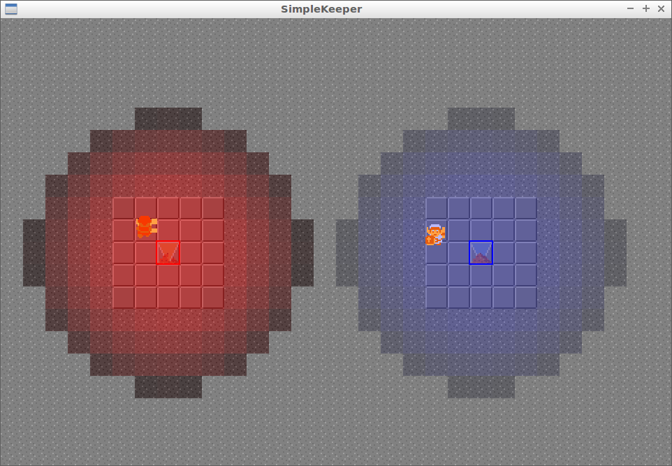

# SimpleKeeper

Branch||
---|---|---
master||
develop||

Simple Dungeon Keeper clone, written in C++ using SFML.

## Credits

 * Overworld sprites by [Zephiel87](http://www.spriters-resource.com/submitter/Zephiel87)
 * Dungeon sprites by [Bacon](http://www.spriters-resource.com/submitter/Bacon)
 * Others sprites: [www.videogamesprites.net](http://www.videogamesprites.net/Zelda1)
 * Music: [zeldauniverse.s3.amazonaws.com](http://zeldauniverse.s3.amazonaws.com/soundtracks/legendofzeldaost/04%20-%20Dungeon.mp3)
 * [Tiled map editor](https://github.com/bjorn/tiled)
 * [STP library](https://github.com/edoren/STP)

## Older screenshots

